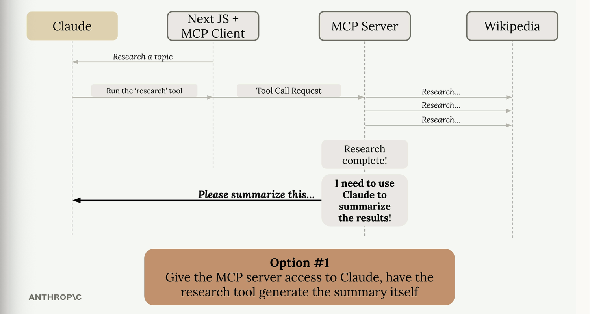
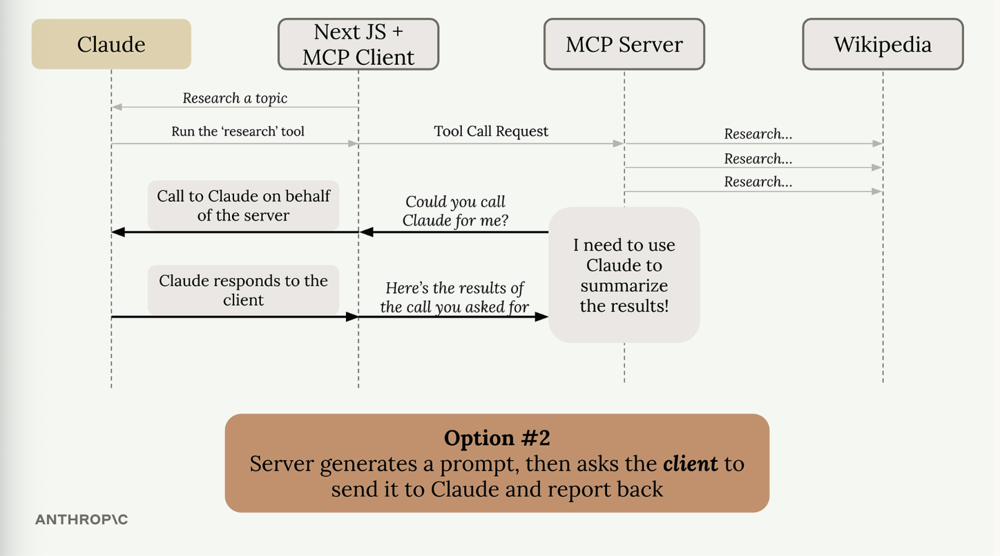

# Sampling

**Question: what is sampling??**
- sampling allows a server to access a language model like Claude through a connected MCP client

- instead of server directly calling Claude, it asks the client to make the call on its behalf. this shifts the responsibility and cost of text generation from the server to the client.

- the flow:
    - server completes its work like fetching Wikipedia articles
    - server creates a prompt asking for text generation
    - server sends a sampling request to the client
    - client calls Claude with the provided prompt
    - client returns the generated text to the server
    - server uses the generated text in its response

**Question: what is the problem that sampling solves??**
- suppose we have an MCP server with a research tool that fetches info from Wikipedia. after gathering all that data, we need to find a way to summarise it into a coherent report right?? how do we go about it??
- we have two options:

    1. give the MCP server direct access to Claude i.e., the server would need its own API key, handle auth, manage costs, and implement all the Claude integration code. this would work but it also adds significant complexity.




2. use sampling. the server generates a prompt and asks the client "could you call Claude for me?" the client, which already has a connection to Claude, makes the call and returns the results.




**Question: what are the benefits of sampling??**
1. reduces server complexity since the server doesn't integrate with language models directly
2. shifts cost burden i.e., the client pays for token usage not the server
3. no API keys needed
4. perfect for public servers


## Implementation

1. Server Side

- in the tool function, we use the `create_message` function to request text generation:

```python
@mcp.tool
async def summarize(text_to_summarize: str, ctx: Context):
    prompt = f"""
    Please summarize the following text:
    {text_to_summarize}
    """
    
    result = await ctx.session.create_message(
        messages=[
            SamplingMessage(
                role="user",
                content=TextContent(
                    type="text",
                    text=prompt
                )
            )
        ],
        max_tokens=4000,
        system_prompt="You are a helpful research assistant",
    )
    
    if result.content.type == "text":
        return result.content.text
    else:
        raise ValueError("Sampling failed")
```

2. Client Side

- we create a sampling callback that handles the server's requests:

```python
async def sampling_callback(
    context: RequestContext, params: CreateMessageRequestParams
):
    # Call Claude using the Anthropic SDK
    text = await chat(params.messages)
    
    return CreateMessageResult(
        role="assistant",
        model=model,
        content=TextContent(type="text", text=text),
    )

# pass the callback when initializing client session
async with ClientSession(
    read,
    write,
    sampling_callback=sampling_callback
) as session:
    await session.initialize()
```