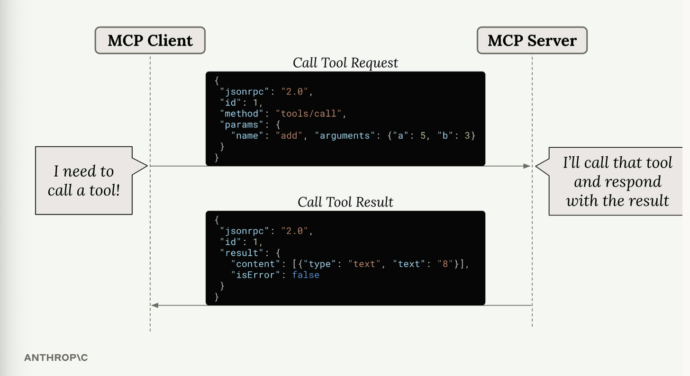
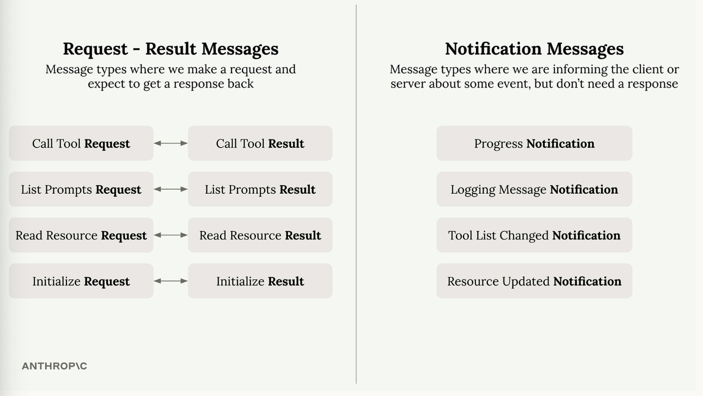

# JSON message types

Model Context Protocol (MCP) uses JSON messages to handle communication between clients and servers.

**Message Format**

- when Claude needs to call a tool provided by an MCP server, the client sends a "Call Tool Request" message. the server processes this request, runs the tool, and responds with a "Call Tool Result" message containing the output.

- messages types are written in TypeScript for convenience as TS provides a clear way to describe data structures and types.
- MCP messages fall into two main categories:

**Client vs Server Messages**

- client messages = include requests that clients send to servers (like tool calls) and notifications that clients might send.

- server messages = include requests that servers send to clients and notifications that servers broadcast