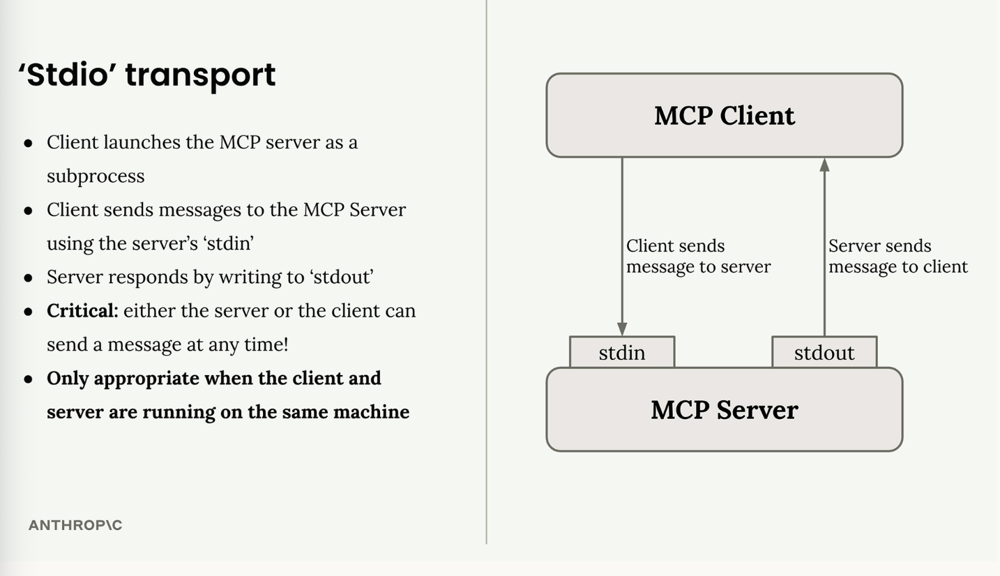

# JSON message types

Model Context Protocol (MCP) uses JSON messages to handle communication between clients and servers.

**Message Format**

- when Claude needs to call a tool provided by an MCP server, the client sends a "Call Tool Request" message. the server processes this request, runs the tool, and responds with a "Call Tool Result" message containing the output.

- messages types are written in TypeScript for convenience as TS provides a clear way to describe data structures and types.
- MCP messages fall into two main categories:

**Client vs Server Messages**

- client messages = include requests that clients send to servers (like tool calls) and notifications that clients might send.

- server messages = include requests that servers send to clients and notifications that servers broadcast

# The STDIO transport

The communication channel used when MCP clients and servers communicates is called **transport**.

**The Stdio Transport**

- here, the client launches the MCP server as a subprocess and communicates through standard input and output streams.

- the client sends messages to the server using the server's `stdin`, then the server responds by writing to `stdout`. 
- either the server or client can send a message at any time and only works when client and server run on the same machine.

**MCP Connection Sequence**

- every MCP connection must start with a specific three-message handshake:
    1. initialize request - client sends this first
    2. initialize result - server responds with capabilities
    3. initialize notification - client confirms (no response expected)